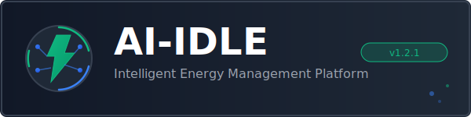

<p align="center">
  
</p>

<h1 align="center">AI-IDLE</h1>

<h3 align="center">
  Stop wasting energy. Start saving with AI.
</h3>

<p align="center">
  <em>The intelligent energy management platform that cuts industrial energy waste by up to 30%<br/>through real-time monitoring, autonomous AI agents, and smart automation.</em>
</p>

<p align="center">
  
  
  
  
</p>

<p align="center">
  <a href="#-why-ai-idle">Why AI-IDLE</a>&nbsp;&bull;&nbsp;
  <a href="#-how-it-works">How It Works</a>&nbsp;&bull;&nbsp;
  <a href="#-features">Features</a>&nbsp;&bull;&nbsp;
  <a href="#-pilot-program">Pilot Program</a>&nbsp;&bull;&nbsp;
  <a href="#-support">Support</a>
</p>

---

<br/>

<p align="center">
  
</p>

<br/>

## Why AI-IDLE

Manufacturing companies waste an average of **15-30% of their energy** — that is money and CO2 going straight out the window.

The cause? Machines running idle overnight. No insight into real consumption. Monthly energy bills that arrive too late to act on. Manual walkthroughs that miss what the human eye cannot see.

**AI-IDLE fixes this.** Permanently.

| Without AI-IDLE | With AI-IDLE |
|----------------|-------------|
| Monthly energy bill surprises | Real-time insights every 10 seconds |
| Manual floor inspections | AI that monitors 24/7, autonomously |
| Guesswork and spreadsheets | Data-driven decisions with AI agents |
| Reactive "fix when broken" | Predictive maintenance before failures |
| 2D floor plans on paper | Interactive 3D Digital Twin |
| No idea what costs what | EPEX spot pricing integration per machine |

---

## How It Works

```
    Your Machines          AI-IDLE Platform           You
    ┌─────────┐           ┌──────────────┐          ┌─────────┐
    │ Machine │──Shelly──►│  Real-time   │          │  Save   │
    │ Machine │──Tasmota─►│  AI Analysis │──────────► Energy  │
    │ Machine │──Tuya────►│  Smart Action│          │  Money  │
    │ Machine │──MQTT────►│  Auto-Report │          │  CO2    │
    └─────────┘           └──────────────┘          └─────────┘
```

**3 simple steps:**

1. **Plug in** — Connect affordable smart plugs (Shelly, Tasmota, Tuya) to your machines. Starting at ~EUR 15 per device.

2. **AI monitors** — AI-IDLE collects power data every 10 seconds, detects anomalies, identifies idle machines, predicts consumption, and finds savings — all automatically.

3. **You save** — Receive actionable insights, automated reports, and let the AI agents optimize your energy usage while you focus on production.

---

## Features

### Autonomous AI Agents `NEW`

4 specialized AI agents work around the clock on your energy data:

- **Energy Agent** — Monitors real-time power consumption, detects idle machines, analyzes per department
- **Cost Agent** — Tracks EPEX spot prices, forecasts costs, identifies savings opportunities
- **Anomaly Agent** — Triages anomalies, provides root cause analysis, scores device health
- **Maintenance Agent** — Predicts maintenance needs, flags overdue tasks, monitors equipment health

Ask questions in plain Dutch or English: *"Hoeveel energie verbruiken we nu?"* or *"Are there any anomalies?"*

### Real-Time Monitoring

- Live dashboard with power, cost, and trend data via WebSocket
- Per-machine sparklines and customizable widget layout
- Remote device control from anywhere
- Mobile-first PWA with offline support and push notifications
- TV casting for factory floor displays

### AI & Machine Learning

- 4-layer anomaly detection (statistical, ML, pattern-based, context-aware)
- Appliance signature recognition for 18+ machine types
- TensorFlow.js for on-device and server-side inference
- Automatic cycle detection and energy predictions
- Natural language AI chat assistant (Dutch + English)

### 3D Digital Twin

- Interactive 3D factory floor with live data per machine
- Drag-and-drop 2D layout editor
- Color-coded status visualization (active/idle/offline)
- Click-to-inspect for detailed metrics

### Sustainability & CO2

- Carbon footprint tracking with Dutch/EU emission factors
- Scope 1/2 emissions monitoring with targets
- Gamification with challenges, badges, and team leaderboards
- Offset management and emissions reporting

### Enterprise Ready

- Multi-tenant with full data isolation
- Role-based access (Developer/Admin/Manager/Viewer)
- MFA/TOTP authentication
- 7 rate limiters, AES-256 encryption, audit logging
- REST + GraphQL + WebSocket APIs
- Integrations: Slack, Discord, Teams, Email, Webhook, SMS
- Automated PDF/Excel reports (daily/weekly/monthly)
- Prometheus + Grafana monitoring
- Docker deployment with horizontal scaling

---

## The Numbers

<table>
<tr>
<td align="center"><h2>243K+</h2><sub>Lines of Code</sub></td>
<td align="center"><h2>97</h2><sub>Database Models</sub></td>
<td align="center"><h2>21</h2><sub>AI Agent Tools</sub></td>
<td align="center"><h2>18</h2><sub>Appliance Profiles</sub></td>
</tr>
<tr>
<td align="center"><h2>841+</h2><sub>Test Files</sub></td>
<td align="center"><h2>4</h2><sub>Autonomous Agents</sub></td>
<td align="center"><h2>10s</h2><sub>Data Interval</sub></td>
<td align="center"><h2>2</h2><sub>Languages (NL/EN)</sub></td>
</tr>
</table>

---

## Pilot Program

<table>
<tr>
<td>

### We're looking for 2 pilot partners!

AI-IDLE is actively seeking **2 pilot locations** in the **SME metal/manufacturing sector** to validate the platform in a real production environment.

#### What you get — completely free:
- Full AI-IDLE platform installation and configuration
- Complete setup and onboarding by the developer
- All software updates and new AI features during the pilot
- Direct communication line with the development team
- Comprehensive evaluation report and optimization advice after the pilot

#### What you provide:
- A production environment with at least 5 machines
- Willingness to provide feedback and collaborate
- Device costs only (Shelly smart plugs, ~EUR 15-25 per machine)

#### After the pilot:
A detailed review covering energy savings achieved, ROI analysis, and optimization recommendations. Your honest feedback helps us build the best energy management platform in the market.

</td>
</tr>
</table>

<p align="center">
  <br/>
  <a href="mailto:ai-idle@outlook.com"></a>
  <br/><br/>
  <sub>No commitment needed — let's start with a conversation.</sub>
</p>

---

## Support

AI-IDLE is built with one mission: **make industrial energy waste a thing of the past**.

Every kilowatt-hour saved means less CO2, lower costs, and a more sustainable industry. If you believe in that mission, here's how you can help:

<p align="center">
  <a href="https://github.com/WimLee115/ai-idle-platform/stargazers"></a>
  &nbsp;&nbsp;
  <a href="https://buymeacoffee.com/wimlee115"></a>
</p>

<p align="center">
  A <strong>star</strong> helps us reach more manufacturing companies who waste energy every day.<br/>
  A <strong>coffee</strong> fuels the late-night engineering sessions that make this platform better.
</p>

---

## Contact

| | |
|-|-|
| **Email** | [ai-idle@outlook.com](mailto:ai-idle@outlook.com) |
| **Pilot inquiries** | [ai-idle@outlook.com](mailto:ai-idle@outlook.com) |
| **Discussions** | [GitHub Discussions](https://github.com/WimLee115/ai-idle-platform/discussions) |
| **Issues** | [GitHub Issues](https://github.com/WimLee115/ai-idle-platform/issues) |

---

## License

Copyright (c) 2024-2026 AI-IDLE. All rights reserved.

AI-IDLE is proprietary software. Contact [ai-idle@outlook.com](mailto:ai-idle@outlook.com) for licensing and partnership opportunities.

---

<p align="center">
  <sub>Built with dedication in the Netherlands</sub><br/>
  <sub>Making industrial energy waste a thing of the past, one machine at a time.</sub>
  <br/><br/>
  <a href="mailto:ai-idle@outlook.com">Contact</a>&nbsp;&bull;&nbsp;
  <a href="https://buymeacoffee.com/wimlee115">Support</a>&nbsp;&bull;&nbsp;
  <a href="https://github.com/WimLee115/ai-idle-platform/discussions">Community</a>
</p>
