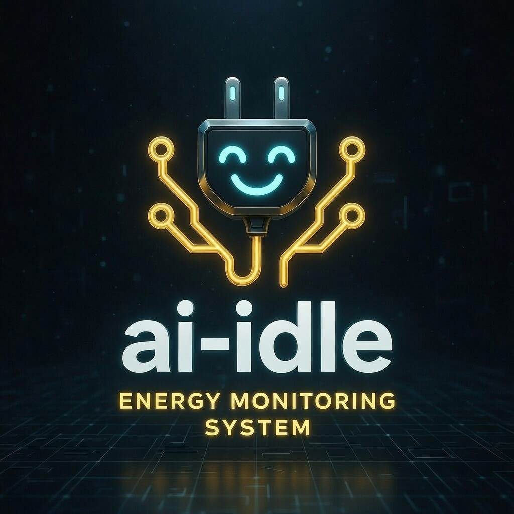

<p align="center">
  
  <br><br>
  <h1>AI-IDLE v1.3.1</h1>
  <h3>Intelligent Industrial Energy Management Platform</h3>
  <p><strong>Stop energy waste. Save up to 30% with AI that monitors, detects and optimizes 24/7.</strong></p>

  <p>
    
    <a href="https://ai-idle.nl"></a>
    <a href="https://ai-idle.nl?lang=en"></a>
    <a href="https://github.com/WimLee115/ai-idle-platform/stargazers"></a>
    <a href="mailto:ai-idle@outlook.com?subject=AI-IDLE%20Pilot%20Interest"></a>
  </p>
</p>

### Stop wasting energy. Start saving with AI.

*The intelligent energy management platform that cuts industrial energy waste by up to 30%*<br>*through real-time monitoring, autonomous AI agents, and smart automation.*

[Why AI-IDLE](#why-ai-idle) | [How It Works](#how-it-works) | [Features](#features) | [What's New](#whats-new-in-v131) | [Pilot Program](#pilot-program) | [Contact](#contact--support)

---

## Why AI-IDLE

Manufacturing companies waste an average of **15-30% of their energy** — money and CO2 literally going to waste.

| Without AI-IDLE | With AI-IDLE |
|---|---|
| Monthly bill surprises | Real-time insights every **10 seconds** |
| Manual floor walks | 24/7 autonomous AI monitoring |
| Spreadsheets & guesswork | AI agents for data-driven decisions |
| Reactive maintenance | Predictive maintenance & anomaly detection |
| No per-machine cost insight | EPEX spot pricing + load-shifting |
| Static 2D floor plans | Interactive **3D Digital Twin** |

---

## How It Works

```
Your Machines           AI-IDLE Platform            You
┌─────────┐            ┌──────────────┐           ┌─────────┐
│ Machine │──Shelly───>│  Real-time   │           │  Save   │
│ Machine │──Tasmota──>│  AI Analysis │──────────>│ Energy  │
│ Machine │──Tuya─────>│  Smart Action│           │  Money  │
│ Machine │──MQTT─────>│  Auto-Report │           │  CO2    │
└─────────┘            └──────────────┘           └─────────┘
  EUR 15-25/plug          4 AI Agents              Up to 30%
  No downtime             24/7 active              savings
```

**3 steps to start saving:**

1. **Plug in** — Affordable smart plugs (Shelly/Tuya/Tasmota, EUR 15-25 each) on your machines. Zero downtime.
2. **AI monitors & learns** — Data every 10 seconds, recognizes 100+ machine types automatically, detects idle waste, anomalies, and predicts consumption.
3. **You save automatically** — Dashboard, AI chat (NL/EN), reports, load-shifting to cheapest hours.

---

## Features

### 4 Autonomous AI Agents

| Agent | Role | Tools |
|---|---|---|
| **Energy Agent** | Consumption analysis, usage patterns, idle detection | 5 specialized tools |
| **Cost Agent** | EPEX pricing, load-shifting, savings calculations | 5 specialized tools |
| **Anomaly Agent** | Spike detection, 4-layer anomaly analysis, alerts | 5 specialized tools |
| **Maintenance Agent** | Predictive maintenance, equipment health scoring | 5 specialized tools |

All agents work together via an **orchestrator** — ask questions in natural language (Dutch or English) and get data-driven answers.

### Interactive 3D Digital Twin

Build your factory floor in 3D and see everything live:

- **Energy flow connections** — 5 types: energy, data, pipe, conveyor, cable
- **Camera presets** — Bird-eye, front, side, follow, walkthrough views
- **KPI overlay** — Real-time power, cost, efficiency, and alert counts
- **Machine detail panel** — Click any machine for live power gauge, metrics, and alerts
- **Heatmap mode** — Visualize power distribution across your floor
- **Layout editor** — Drag-and-drop with undo/redo, keyboard shortcuts, and snap guides

### Real-time EPEX Spot Pricing

Two production-ready energy price providers:

- **ENTSO-E Transparency Platform** — Free EU Day-Ahead prices for 8 bidding zones
- **MATS / EPEX SPOT** — Direct market access with mTLS authentication
- **Smart scheduling** — Automatically shift loads to cheapest hours

### Full Feature Overview

| Feature | Description |
|---|---|
| **Real-time Dashboard** | WebSocket live updates, sparklines, customizable widgets, TV-cast mode |
| **100+ Appliance Profiles** | Auto-recognition for metalworking, woodworking, food, plastics, welding, textile, HVAC, and more |
| **CO2 & Sustainability** | Real-time carbon tracking, gamification challenges, CSRD-ready reports |
| **Audit Dashboard** | Compliance tracking, industry benchmarking, AI analytics over time |
| **Enterprise-ready** | Multi-tenant, MFA, RBAC, Docker, REST + GraphQL APIs |
| **Offline Demo Mode** | USB-stick deployable demo for client presentations (Windows/Mac/Linux) |

---

## What's New in v1.3.1

- **3D Digital Twin upgrade** — Energy flow connections, camera presets, KPI overlay, machine detail panel with power gauges, heatmap visualization
- **ENTSO-E + MATS providers** — Real EU Day-Ahead spot prices (no more mock data)
- **100 new appliance profiles** — Industrial machine recognition expanded from 18 to 118 types across 13 categories
- **Layout editor v2** — Connection drawing tool, undo/redo (50 entries), clipboard, keyboard shortcuts, context menu
- **Backend bulk sync** — Elements, zones, and connections synced in single transactions
- **Service upgrades** — Carbon, benchmarking, energy-cost, AI analytics improvements

### Previous: v1.3.0

- Audit Dashboard with compliance tracking
- AI Analytics Dashboard
- New 2026 branding and intro video
- Offline Docker Demo for presentations
- CodeQL SAST security scanning

---

## Technology Stack

| Layer | Technology |
|---|---|
| **Frontend** | React 19, TypeScript 5.8, Vite 7, Tailwind CSS 3.4, Zustand 5, TanStack Query 5, Three.js, TensorFlow.js 4, Motion 12 |
| **Backend** | Express 5, TypeScript 5.8, Prisma 7 (97 models), Apollo Server 5 (GraphQL), Socket.IO 4, BullMQ 5 |
| **AI/ML** | Proprietary rule-based engine, TensorFlow.js (server + browser), 4-layer anomaly detection, appliance signature recognition |
| **Database** | PostgreSQL 16 + TimescaleDB, Redis 7 |
| **Monitoring** | Prometheus, Grafana, Alertmanager (20+ rules) |
| **CI/CD** | GitHub Actions, Node.js 22 LTS |
| **Deployment** | Docker Compose, Nginx, horizontal scaling |

### By the Numbers

<table>
<tr>
<td align="center"><h2>243K+</h2><sub>Lines of Code</sub></td>
<td align="center"><h2>97</h2><sub>Database Models</sub></td>
<td align="center"><h2>20</h2><sub>AI Agent Tools</sub></td>
<td align="center"><h2>118</h2><sub>Appliance Profiles</sub></td>
</tr>
<tr>
<td align="center"><h2>841+</h2><sub>Test Files</sub></td>
<td align="center"><h2>4</h2><sub>Autonomous Agents</sub></td>
<td align="center"><h2>10s</h2><sub>Data Interval</sub></td>
<td align="center"><h2>2</h2><sub>Languages (NL/EN)</sub></td>
</tr>
</table>

---

## Pilot Program

We're looking for **2 SME pilots** in manufacturing (min. 5 machines).

**Free for you:**
- Full installation & onboarding by the developer
- All updates + new features during pilot
- Personal support & direct influence on roadmap
- ROI report with proven savings

**You provide:**
- Production environment with machines
- Feedback on the platform
- Hardware costs only (EUR 15-25 per smart plug)

**No obligations — start with a free conversation.**

<p align="center">
  <a href="mailto:ai-idle@outlook.com?subject=AI-IDLE%20Pilot%20Interest&body=Company:%0AName:%0ANumber%20of%20machines:%0ABriefly%20describe%20your%20energy%20challenges:"></a>
</p>

---

## Contact & Support

| | |
|-|-|
| **Email** | [ai-idle@outlook.com](mailto:ai-idle@outlook.com) |
| **Pilot / Sales** | [ai-idle@outlook.com](mailto:ai-idle@outlook.com) (subject: Pilot Interest) |
| **Community** | [GitHub Discussions](https://github.com/WimLee115/ai-idle-platform/discussions) & [Issues](https://github.com/WimLee115/ai-idle-platform/issues) |
| **Website** | [ai-idle.nl](https://ai-idle.nl) |

<p align="center">
  <a href="https://github.com/WimLee115/ai-idle-platform/stargazers"></a>
  &nbsp;&nbsp;
  <a href="https://buymeacoffee.com/wimlee115"></a>
</p>

---

<p align="center">
  Built in the Netherlands — with passion for smart, sustainable industry.<br/>
  <sub>Copyright &copy; 2024-2026 AI-IDLE. All rights reserved.</sub>
</p>
